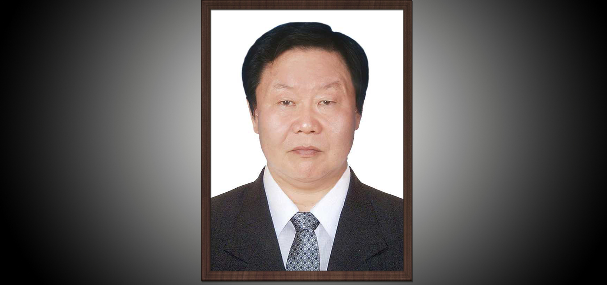
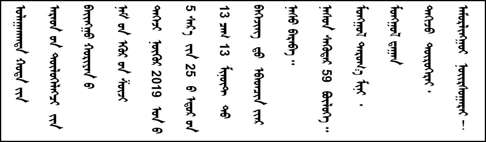
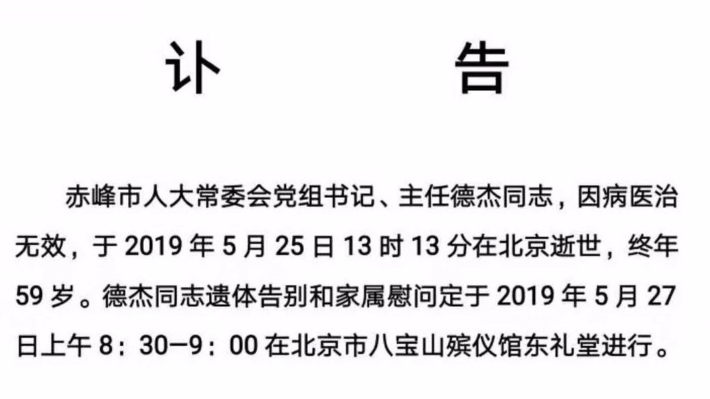

## 德杰同志纪念馆

### 德杰同志生平

> ​	中国共产党的优秀党员、党的优秀民族干部，赤峰市人大常委会党组书记、主任德杰同志因病医治无效，于2019年5月25日13时XX分在北京逝世，终年59岁。
>
> ​	德杰同志1961年1月出生于克什克腾旗，1983年7月参加工作，1985年12月加入中国共产党。1983年7月至1983年12月，在内蒙古党校首届青年干部训练班学习；1983年12月至1998年11月，先后在翁牛特旗供销社、财政局、物价局、商业局、粮食局、粮油经营总公司工作；1998年11月任翁牛特旗政府副旗长；2002年1月任巴林右旗委副书记、政府旗长（其间：2003.08—2003.12在中国银行挂职任零售业务部总经理助理）；2006年1月任巴林右旗委书记；2011年8月任赤峰市委常委、统战部长（其间：2014.07—2015.07挂职任北京市民族事务委员会副主任、北京市宗教事务局副局长）；2016年10月任赤峰市人大常委会党组副书记；2017年1月任赤峰市人大常委会党组书记；2017年3月任赤峰市人大常委会党组书记、主任。德杰同志无论在哪个工作岗位，都能认真贯彻落实上级党委的决策部署，结合实际创造性地开展工作，为赤峰的经济社会发展做出了积极贡献。
>
> ​	德杰同志在翁牛特旗工作期间，工作讲究方式方法，在市场经济发展条件不完善的情况下，敢于啃硬骨头，勇于攻坚克难，积极推进体制机制改革，尽职尽责地完成了各项目标任务，受到单位领导和同事的一致好评。1991年被授予内蒙古自治区税收、财务、物价大检查先进个人称号。
>
> ​	德杰同志在巴林右旗担任党政主要领导期间，树立了“全党抓经济，重点抓工业，突出抓项目，关键抓招商”的理念，提出了“生态立旗、工业强旗、开放兴旗”发展战略，采取“立足优势抓工业，紧盯项目抓工业，建设园区抓工业，招商引资抓工业”等措施，大力推动工业发展，开创了经济社会发展的良好局面。2005年被科技部评为全国市（县、区）科技进步工作先进个人。
>
> ​	德杰同志在担任赤峰市委常委、统战部长期间，带头学习宣传和贯彻落实党的统一战线理论政策和法律法规,认真执行党的民族政策，依法管理宗教事务，建立了民主党派、无党派代表人士建言献策和反映情况直报制度，不断深化政党协商、与党外代表人士联谊交友工作，取得了良好的社会效果。
>
> ​	德杰同志在担任赤峰市人大常委会党组副书记、党组书记、主任期间，认真学习贯彻落实党的十九大精神和习近平新时代中国特色社会主义思想，树牢“四个意识”, 坚定“四个自信”, 做到“两个维护”，坚持党对人大工作的领导，始终把讲政治摆在首要位置，紧紧围绕市委中心工作开展立法、监督、代表等工作，重视培养使用少数民族干部，关心关爱关注干部的成长，积极学习研究人民代表大会理论和人大工作知识，始终保持对人大工作的热情，严格依法办事，注重党的建设、执法检查、代表视察、换届选举等工作，为推动我市民主法制建设和经济社会发展作出了重要贡献。
>
> ​	德杰同志参加工作30多年来，为党和国家的事业奉献了毕生的精力。他始终以马列主义、毛泽东思想、邓小平理论、“三个代表”重要思想、科学发展观、习近平中国特色社会主义思想为指导，自觉在思想上政治上行动上同党中央保持高度一致。他忠于党的事业，全心全意为人民服务，注重自身修养，始终保持共产党员的优秀品质。他认真学习领会党的路线、方针和政策，对革命事业充满热情，热爱本职工作。他以党和国家利益为重，尽职尽责地完成了党交给的工作任务，为我市经济建设和社会发展，为推动爱国统一战线以及全市人大工作做出了积极贡献。
>
> ​	德杰同志的一生，是为党和人民的事业辛勤工作的一生，努力奋斗的一生。他的逝世，使我们失去了一位好党员、好干部、好同志。我们要学习德杰同志勤勉敬业、求真务实的工作态度，学习他严于律己、团结同志的优秀品质，学习他艰苦朴素、廉洁奉公的优良作风。我们悼念德杰同志，就是要化悲痛为力量，在以习近平同志为核心的党中央领导下，高举中国特色社会主义伟大旗帜，扎实工作，开拓进取，为实现赤峰跨越崛起、全面建成小康社会而努力奋斗！
>
> ​	德杰同志，安息吧！

> ​	德厚承前，
>
> ​        王者征途。
>
> ​        常怀虚无，
>
> ​        胜有海量。
>
> ​			—“闯海人”

> 从草原来 乡旗市 为党为民奉心怀
>
> 怀丹心走 刚直强 坦荡亲诚昭苍穹
>
> ​					——“增广贤文”

> 《阳关三叠送德王》
>
> ​	一
>
> 当年同赴翁牛特，
>
> 岁寒三友濡以沫。
>
> 胼手砥足齐努力，
>
> 青春热血共拼搏。
>
> 
>
> 如今正是英年时，
>
> 鞠躬尽瘁为家国。
>
> 忽闻贤弟驾鹤去，
>
> 肝肠寸断泪滂沱。
>
> 
>
> ​	二
>
> 蒙中镇委与旗社，
>
> 王姐建军与弟汝。
>
> 三十五载蒙汉亲，
>
> 一生一世如手足。
>
> 
>
> 长姐如嫂勤照料，
>
> 兄弟二人常执壶。
>
> 仕途无悔虽劳碌，
>
> 醉里千秋天不负。
>
> 
>
> ​	三
>
> 如今三友弟先去，
>
> 他年天国再聚首。
>
> 三人同行小弟苦，
>
> 琼宫备好桂花酒。
>
> 
>
> 一饮同心结此缘，
>
> 二饮青干吾同酬。
>
> 三饮莫忘姐弟情，
>
> 人间天堂永相守。
>
> ​	――己亥年夏日（2019年5月29日）“闯海人”写于XXX

> 《一悼德杰》
>
> 德可配位，草根创业，餐风饮露，成就理想信念，勘当大任
>
> 杰出贡献，基层情节，初心不忘，谱写完美人生，含笑九泉
>
> 《二悼德杰》
>
> 生未进中南海，几度挂职赴京城，耿耿丹心照日月
>
> 死终入八宝山，长眠福地无忧念，悠悠情怀写春秋
>
> ​										——GH

> 《悼念德杰同学》
>
> 曾经带笑说病妖，
>
> 转瞬西行奈何桥。
>
> 坦荡胸襟仍豪迈，
>
> 德杰最是善自嘲。
>
> 直言爽话通真理，
>
> 仗义疏才有至交。
>
> 广众应怀失子憾，
>
> 人民公论做墓标。
>
> 
>
> 昨日有泪雨潇潇，
>
> 缅怀德杰荡心潮。
>
> 巴林重任承冬雪，
>
> 统战赤峰鼓春宵。
>
> 如火激情动乡里，
>
> 真诚报国人最骄。
>
> 英年早逝仍潇洒，
>
> 无憾今生效民劳。
>
> ​		——ML

> 《悼德杰》
>
> 为初心奔赴基层百炼千锤；
>
> 为百姓呕心沥血鞠躬尽瘁！
>
> ​		——Z

[《德杰走了》]([原创]德杰走了_牧羊女-陶娅_新浪博客.pdf)

[《德杰走了》原文链接](http://blog.sina.com.cn/s/blog_17c41efb00102z4hp.html)

> ​	德王的一生，光明磊落，心系家国，豪爽坦荡，雷厉风行。他即是一个铮铮铁汉，又是一个重情重义的好兄弟！一生无愧无憾。
>
> ​       在共同经历了悲痛之后，我仍愿以“赞歌”来为他送行，仍愿赞美生命之伟大，青春奋斗之美好，友情之地久天长！
>
> ​								――己亥年夏日（2019年儿童节）“闯海人”写于XXX

